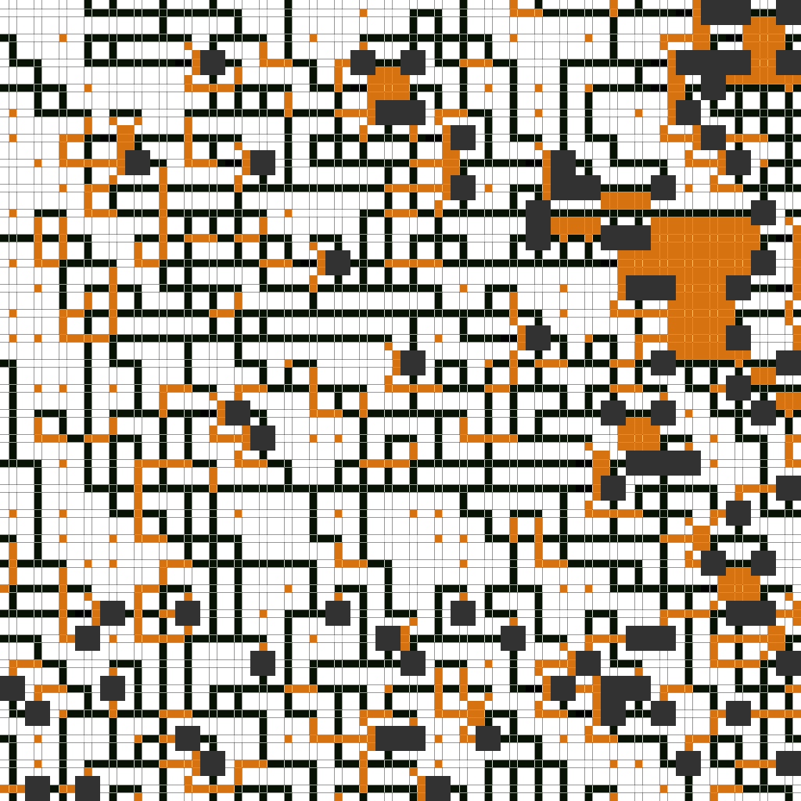

# py_wfc

Procedural Tile-Based Generation | Wave Function Collapse

## WaveThresholdOverlap3D - Procedural Tile-Based Generation

A Python implementation of the Wave Function Collapse (WFC) algorithm with threshold-based constraints for 3D procedural tile generation. This solver is optimized for generating tile-based structures while ensuring pattern consistency and spatial constraints.

## Features
- Supports 2D and 3D tile-based procedural generation.
- Implements Wave Function Collapse (WFC) with a threshold-based approach.
- Includes Simulated Annealing for alternative pattern resolution.
- Provides wrapping and padding options for seamless tiling.
- Optimized with NumPy for fast computation.

## Usage
Load an input pattern from an image or a predefined tile set, define constraints, and generate new procedural structures with controlled randomness.

